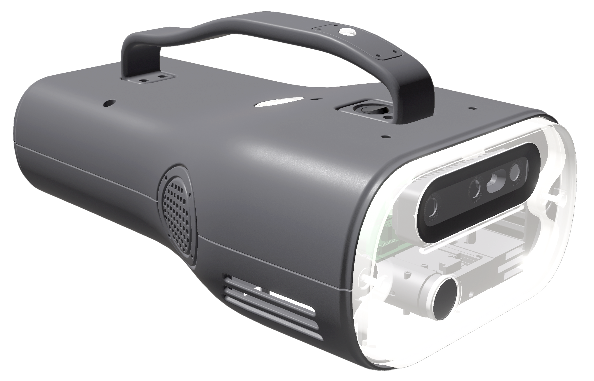

# AR Magic Lantern SDK
**[GitHub](https://github.com/fubilab/arml-sdk) ·
  [Documentation](https://fubilab.github.io/arml-sdk/) ·
  [Project Home](https://emil-xr.eu/lighthouse-projects/upf-ar-magic-lantern/) ·
  [Discord](https://discord.gg/zWZT3yKf4q)**

This repository contains a Software Development Kit (SDK) for creating augmented reality (AR) experiences for the AR Magic Lantern (ARML), an ongoing research project led by the [Full-Body Interaction Lab](https://www.upf.edu/web/fubintlab) at [Universitat Pompeu Fabra](https://www.upf.edu/). 

- [Project Home](https://emil-xr.eu/lighthouse-projects/upf-ar-magic-lantern/)  
Background information about the project and its history.

- [SDK Documentation ](https://fubilab.github.io/arml-sdk/)  
Start here if you want to develop with the SDK.

- [Unity template project](./arml-unity/)  
Start building games and experiences for the ARML in Unity.

- [ARML Hardware](https://fubilab.github.io/arml-sdk/docs/hardware.html)  
Learn how to build or obtain the AR Magic Lantern hardware.

- [Generate Documentation](./arml-website/)  
Learn how to edit and build the SDK documentation website.

&nbsp;&nbsp;

&nbsp;&nbsp;

