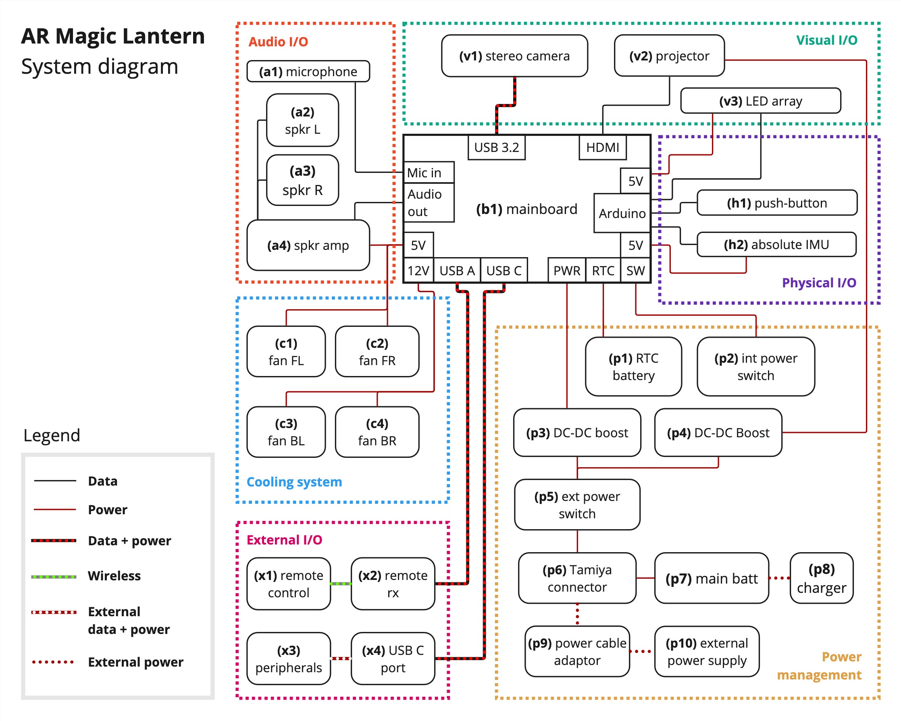
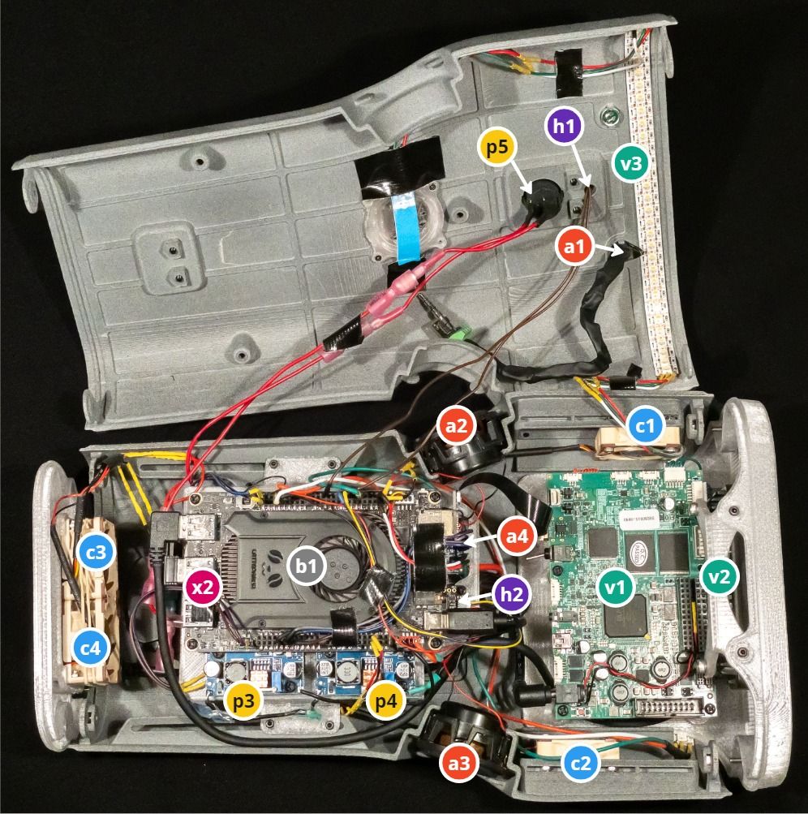
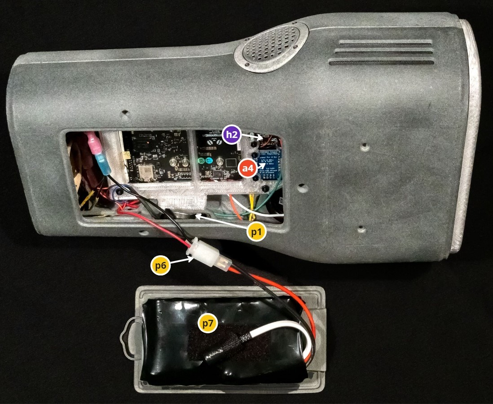
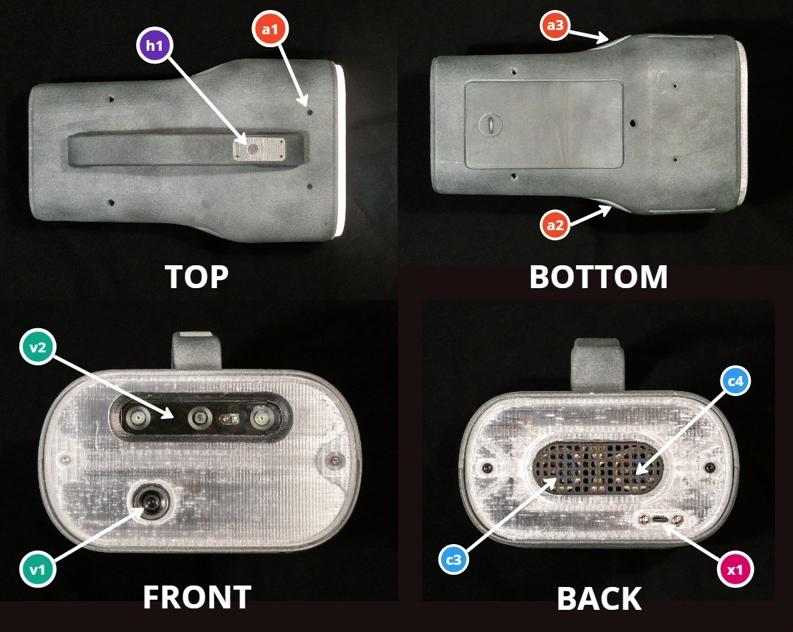

# ARML Component Reference

## Component layout

*Diagram showing components of the AR Magic Lantern and how they are connected. The labels on each component correspond to labels in the images of the physical hardware and in the component list.*

*Photo of the ARML with the upper and lower parts of the housing separated, so the internal components are visible. The labels correspond to labels in the system diagram and the component list.*

*Photo of the ARML from the bottom, with battery compartment door removed. The labels correspond to labels in the system diagram and the component list.*

*Photos of the ARML from the top, bottom, front and back. The labels correspond to labels in the system diagram and the component list.*

## Component list

| | Description | Vendor&nbsp;Links&nbsp;&nbsp;&nbsp;&nbsp; |
| --- | --- | --- |
| a1  | Electret condenser microphone. Leads wrapped in copper shielding tape. Connected with TRRL audio plug breakout board to microphone input on mainboard. | [Amazon](https://www.amazon.es/gp/product/B07CGTJ9NV/)
| a2, a3 | Tang Band W1-2121S full-range speakers, 12W power handling. Connected to speaker outputs on (a4) | [SoundImports](https://www.soundimports.eu/en/tang-band-w1-2121s.html) |
| a4  | Class D stereo audio amplifier (MAX98306), 3.7W per channel. Connected to audio output on the mainboard.  _Voltage_: 5V from mainboard | [Amazon](https://www.amazon.es/dp/B00KLBTQPS) |
| v1  | OAK-D Pro W stereo wide-angle camera with hi-resolution colour centre camera (IMX378). Connected with USB 3.2 SuperSpeed cable to mainboard. | [Luxonis](https://shop.luxonis.com/products/oak-d-pro-w?variant=43715946447071) |
| v2  | EKB Technologies E4500MKIIRGBHP-OXF DLP development module, 700 lumens, on-axis, extended depth of focus.  _Voltage_: 11-16V, 12V nominal; _Current_: 6A typical, 7A max |  [EKB](https://www.ekbtechnologies.com/e-store/dpm-e4500mkii-focus-extended-depth-of-focus-800-lumens-on-axis) |
| v3  | Addressable LED strip compatible with Neopixel libraries, RGBW (RGB + white) Powered by 5V DC from the mainboard. Connected to Arduino digital output for programmability.  _Total LEDS_: 63; _Logo window_: 9; _Top_: 30; _Bottom_: 24  _Voltage_: 5V nominal (from mainboard); _Current_: 1.3A typical, 3.8A max | [Amazon](https://www.amazon.es/gp/product/B01N0MA316?th=1) |
| b1  | LattePanda 3 Delta 864 mainboard with Intel N5105 mobile processor. Onboard ATMEGA32U4 microcontroller for Arduino development. 8GB RAM, 64GB eMMc, Onboard WiFi, Bluetooth, Audio input/output.  _Voltage_: 11-15V; _Current_: 2A typical, 3A max | [DFRobot](https://www.dfrobot.com/product-2594.html) |
| h1  | Tactile push-button mounted on top of the handle. Connected to Arduino digital input. | [Amazon](https://www.amazon.es/gp/product/B07WPBQXJ9/ref=ppx_yo_dt_b_search_asin_title?ie=UTF8) |
| h2  | Bosch BNO055 9-DOF IMU with onboard microprocessor and sensor fusion. | [Amazon](https://www.amazon.es/gp/product/B08GY7WKZ3) |
| c1, c2 | Noctua 10mm ultra-low-noise intake fans mounted in front next to projector heatsinks.  _Voltage_: 5V from the mainboard. | [Amazon](https://www.amazon.es/Noctua-NF-A4X10-FLX-5V-ordenador-Ventilador/dp/B00NEMGCIA) |
| c2, c3 | Noctua 20mm ultra-low-noise exhaust fans mounted in back. Powered by 5V DC from the mainboard. | [Amazon](https://www.amazon.es/Noctua-NF-A4x20-FLX-Premium-Quality-Quiet/dp/B071W6JZV8?th=1) |
| p1  | Holder (1) for CR2477 3V long-life RTC battery (1000mAh) (2). Connected to RTC battery leads on mainboard. *Due to design flaw in current LattePanda release, when battery is exhausted, mainboard no longer powers on with main switch (p5). Manual power switch (p2) must be used until battery is replaced. | [Amazon(1)](https://www.amazon.es/dp/B07KFB9HDW) [Amazon(2)](https://www.amazon.es/dp/B08F9HSS6X) |
| p2  | Push-button switch to manually power on the mainboard. Mounted within the battery compartment for admin use (see p1 notes). Connected to the power switch leads on the mainboard. | [Amazon](https://www.amazon.es/gp/product/B07WPBQXJ9/ref=ppx_yo_dt_b_search_asin_title?ie=UTF8) |
| p3, p4 | LM2587 boost converters with breakout boards. Input is unregulated DC 12V from main battery or external power supply, output is regulated DC 13.3V to (p3) mainboard and (p4) projector.  _Voltage_: 11-13V input, 13.3V output; _Current_: 5A max (each) | [Amazon](https://www.amazon.es/dp/B07RKDB2VP) |
| p5  | KCD1 External power switch mounted on top part of body, under the handle. Interrupts all battery and external power supply current. | [Amazon](https://www.amazon.es/dp/B09VZ74QCL) |
| p6  | Tamiya compatible 2-pin 13.5mm 10A connector | [Amazon](https://www.amazon.es/dp/B07ND8SPBH) |
| p7  | BLR-1210 Main battery pack: 12V, 10Ah (120W). See [Power Reference](power.md) | [BaLiRe](https://bateriadelitiorecargable.com/) |
| p8  | Charger for 12V DC battery pack, 2A(1) or 5A(2) | [AliExpress(1)](https://www.aliexpress.com/item/1005006233034942.html) [AliExpress(2)](https://www.aliexpress.com/item/1005001608750083.html) |
| p9  | External 12V DC power supply, minimum current 5A (60W). See [Power Reference](power.md) | [Amazon](https://www.amazon.es/dp/B07PGLXK4X) |
| x1  | Remote control with typical AndroidTV button layout. | [Amazon](https://www.amazon.es/dp/B08DY83SSD) |
| x2  | Receiver for x1 remote control. Connected to USB A port of mainboard. |
| x3  | USB peripherals such as a memory stick, hub, etc. |
| x4  | External USB C port. Connected to (extends) USB C port on mainboard. Supports USB-C PD (power delivery) standard for powering the mainboard in development mode. Cable: USB C male to female, 30cm | [Amazon](https://www.amazon.es/dp/B08HS6X44P?th=1) |