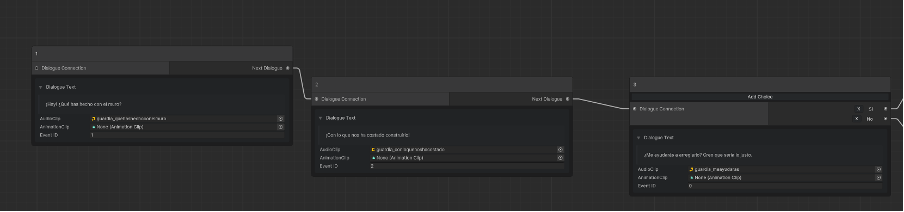
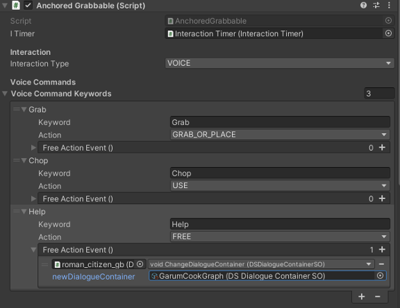

# Features

This page describes the major features provided by the ARML SDK. Most of these features are implemented and described in either the [Wall Game](wallgame.md) or [Garum Game](garumgame.md) example applications.

## Camera and Rendering

The SDK contains several features that provide rendering configuration and optimization for the ARML device runtime. They are built on the URP (Universal Render Pipeline) for Unity, so the user must choose that rendering pipeline when configuring their Unity project. If the user started their ARML application by copying the template in the SDK (recommended), this rendering pipeline has already been chosen and configured. 
Rendering features and preset customizations include:
-	Render settings that are optimal for the ARML graphics subsystem,
-	Stencil layers and shaders that facilitate portal effects (see Wall Game Walkthrough)
The SDK template project contains a camera component with several customizations, including:
-	Field of view that matches the projection FOV,
-	A vignette canvas object that creates the effect of the flashlight borders in the projection,

Most importantly, the camera also contains the components that transfer the orientation and position data from the sensor and tracking subsystems to the camera’s orientation and position.

## Object Interaction

The SDK includes several components that are placed on Unity game objects to add interaction capabilities such as activating, grabbing and dropping to the object. These components communicate with the camera object to facilitate player interaction with objects in the scene. When configuring the interaction for a specific object, the user can choose between 3 different modes of interaction: (a) Dwell, where the camera must linger on the object for a specified amount of time before the interaction begins, (b) Button, where the player must press a button on the ARML to initiate the interaction and (c) Voice Command, where the player must speak to interact with the object (see Voice Commands below). 
- **Dwell**: For interactable objects configured to use the Dwell interaction type, players must hold the crosshairs of the lantern over the object for a specified amount of time (2.5 seconds by default) to trigger the primary action of the interactable. 
- **Button**: For interactable objects configured to use the Button interaction type, players must press the physical button on the lantern when the crosshairs are over the object to trigger the primary action of the interactable. 
- **Voice Commands**: See Voice Commands below for an explanation of interactable objects configured to use the Voice Command interaction type. 

For an example of these interactions and more detailed explanation of the various object interaction components and modalities, see the game examples.

##	Non-playable characters
There are a few utility components in the SDK to help users create engaging non-playable characters (NPCs) in their applications. These components primarily assist with tasks related to the character’s face, including adding a life-like blinking effect and a component that moves the face towards where the player is standing. See the NPC section of the component reference for details.

##	Dialogue system

The SDK implements and extends an open source dialogue system for Unity (Wafflus/unity-dialog-system on GitHub) that uses Unity’s new Graph View API to present a node-based form of designing character dialogue. The system allows the user to create dialogue nodes that defines the audio, text and animation of a piece of the dialogue script. Users create dialogue flow and branching by adding multiple-choice options to a node and connecting them to other nodes. 

  
*Screenshot from Unity editor showing dialogue system editor for Wall Game example.*

Dialogues are attached to objects with which the player will interact, which would normally be non-playable characters (NPCs). The process of creating and editing a dialogue flow for an NPC is covered in the Wall Game walkthrough below. 

##	Voice Commands
  
*Screenshot of the Build Settings window configured for building the Garum Game example scene to the ARML.*

When configuring object interaction (see above), the SDK user may choose “VOICE” as the interaction type. When the player points the ARML at an object with voice interaction enabled, a microphone icon is shown in the crosshair area of the projection. The player begins the voice command by pressing and holding the physical button on the lantern. The ARML plays an audio tone and changes the microphone icon colour to red to indicate that it is listening for a voice command. It may also show text next to the object listing the voice commands that are possible on the object. When the player releases the button, another tone sounds and the microphone icon is replaced with an icon that indicates that the ARML is processing the voice command. If the command is understood, the game proceeds with the action specified by the command. Otherwise, the ARML shows a message next to the object asking the player to try again.

To configure an object for voice command interaction, the SDK user specifies a list of keyword/action assignments in the Interactable component.

Each keyword/action assignment entry allows the user to specify an action that is performed when a keyword is detected in the player’s speech. The Keyword field for each entry must be a single word to listen for in the player’s spoken response. The Action field can be set to one of the following pre-defined actions:
- **GRAB_OR_PLACE**: This refers to the interactable’s grab action, or its place action if it has already been grabbed state (see 4.2.3 Interactables > Tool PlacementTargets for an example of this action). 
- **USE**: This predefined action refers to the action assigned to the object that is triggered specifically when the button is pressed while the object is in a grabbed state (see 4.2.3 Interactables > Knife and Fish for an example of this action). 
- **FREE**: Setting Action to FREE requires the user to also configure the Free Action Event parameter by choosing a function to call when the action is triggered. This allows advanced users to extend the interaction system by writing custom functions or composing actions from existing functions in the library (see Script Reference).

## Voice Dialogue Control
Another voice interaction feature available in the SDK is Voice Dialogue Control (VDC). The VDC system is integrated into the Dialogue system (see above) so that an existing dialogue flow can be controlled by the player’s voice. The player can interact with the dialogue using their voice by default if the “Voice Command Mode” is activated in the SDK configuration (see below). The VDC automatically generates keywords to listen for in a player response from the response options specified in the dialogue node. As with voice commands, the player responds to a dialogue prompt by holding the ARML button and, after the tone, speaking the response.

##	Timeline
The SDK extends the Unity timeline API to provide the user a way of sequencing actions within their game/application. Using an interface familiar from non-linear editing software such as Adobe Premiere Pro, users can add visual blocks to the timeline to control the sequence of gameplay elements such as animation, dialogue, audio cues, game object activation, etc.
