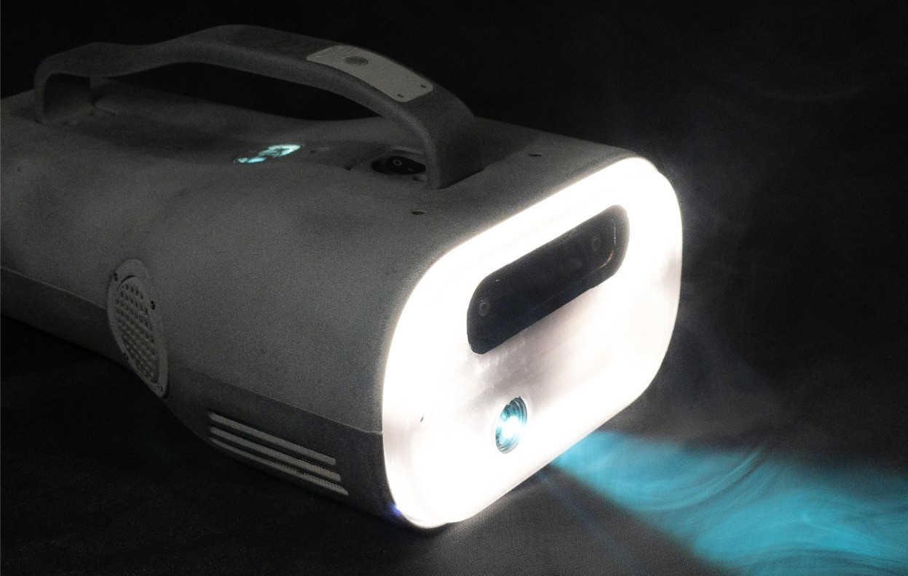

# ARML Hardware Reference Design

The AR Magic Lantern prototype described here is an open-source reference design that can be built from components available to the general public.

If you are interested in obtaining an ARML hardware developer kit, please contact us on our [Discord](https://discord.gg/zWZT3yKf4q).

### Contents
- [Component Reference](components.md)
- [Wiring Reference](wiring.md)
- [Power Reference](power.md) 
- [Peripherals](peripherals.md) 

### Hardware Summary

*Photo of AR Magic Lantern with system powered on*

In addition to a powerful, 600 ANSI lumen projector, the ARML contains a camera/IMU module, a mainboard with a powerful processor and GPU, stereo speakers, a microphone, and an embedded cooling system. It is powered by a rechargeable, swappable lithium-ion battery that allows 90 minutes to 2 hours of play time, depending on the system load. The system also integrates an Arduino-compatible microcontroller for marshalling input from a button on the device's handle and controlling an LED array mounted in the front of the ARML.

### Physical Specifications

| Attribute                                                         | Value                 |
|-------------------------------------------------------------------|-----------------------|
| Max Width (front)                                                 | 200mm                 |
| Height (front)                                                    | 110mm                 |
| Width (back)                                                      | 145mm                 |
| Height (back)                                                     | 80mm                  |
| Max Height (with handle)                                          | 150mm                 |
| Length                                                            | 330mm                 |
| Weight (without battery)                                          | 1.6kg                 |
| Weight (with 10Ah battery[^1])                                    | 1.9kg                 |

### Electrical Specifications

These specifications apply when powering the ARML via the connector in the battery compartment. For information on powering the device via the USB-C port on the back, see [Using USB-C power](./power.md#using-usb-c-power).

| Attribute                                                         | Value                 |
|-------------------------------------------------------------------|-----------------------|
| Min input voltage                                                 | 11VDC                 |
| Max input voltage                                                 | 13VDC                 |
| Current (min)                                                     | 5A                    |
| Current (typical)                                                 | 8A                    |
| Current (max)                                                     | 10A                   |
| Autonomy (with 10Ah battery[^1])                                  | 1.5 - 2 hours         |
| Battery charge time (10Ah battery, 2A charger[^2])                | 12 hours              |
| Battery charge time (10Ah battery, 5A charger[^3])                | ~3 hours              |

[^1]: [10Ah battery](./power.md#battery-specifications)
[^2]: [2A battery charger](./peripherals.md#accessories)
[^3]: [5A battery charger](./peripherals.md#accessories)