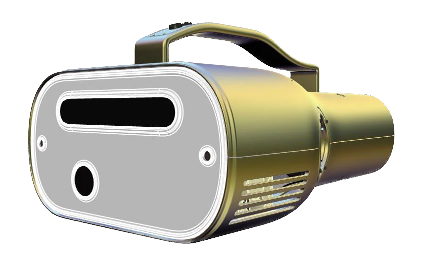

This website provides an overview and reference of a Software Development Kit (SDK) used to create augmented reality (AR) experiences for the AR Magic Lantern (ARML), a novel AR device that has the form-factor of a flashlight and projects AR content onto physical surfaces around the user. By introducing the SDK through examples, the website will serve as a guide for building interactive AR software applications that take advantage of the unique sensors and imaging capabilities of the ARML without requiring a deep understanding of computer vision, augmented reality, or even computer programming. The SDK provides a library of pre-built components that give creators the building blocks for game-like interactive applications, including components for player movement, object interaction, sound effects, non-playable character control, animation timeline, dialog trees, and game level state and advancement.

