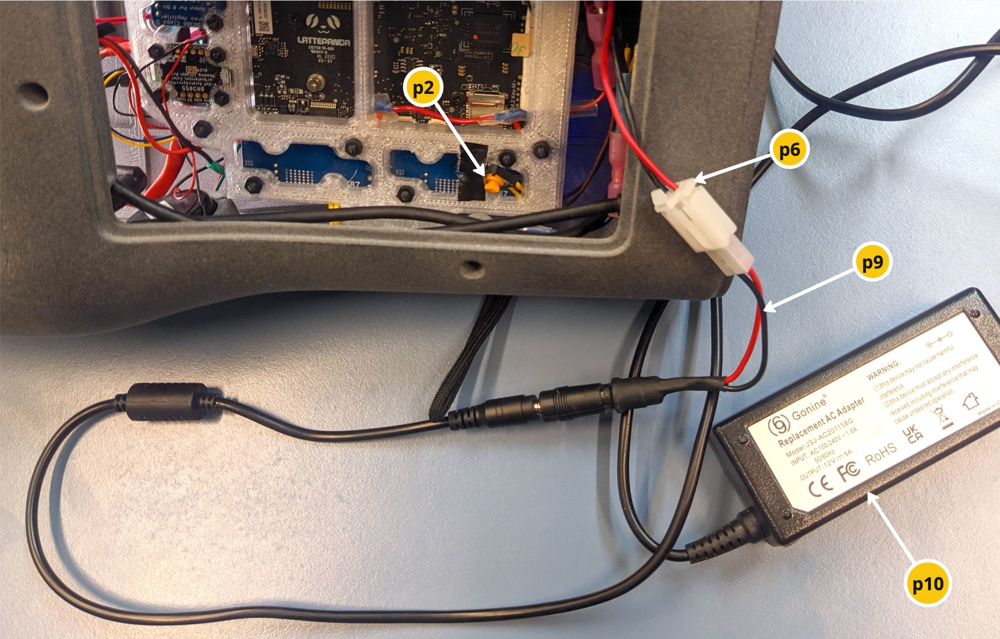
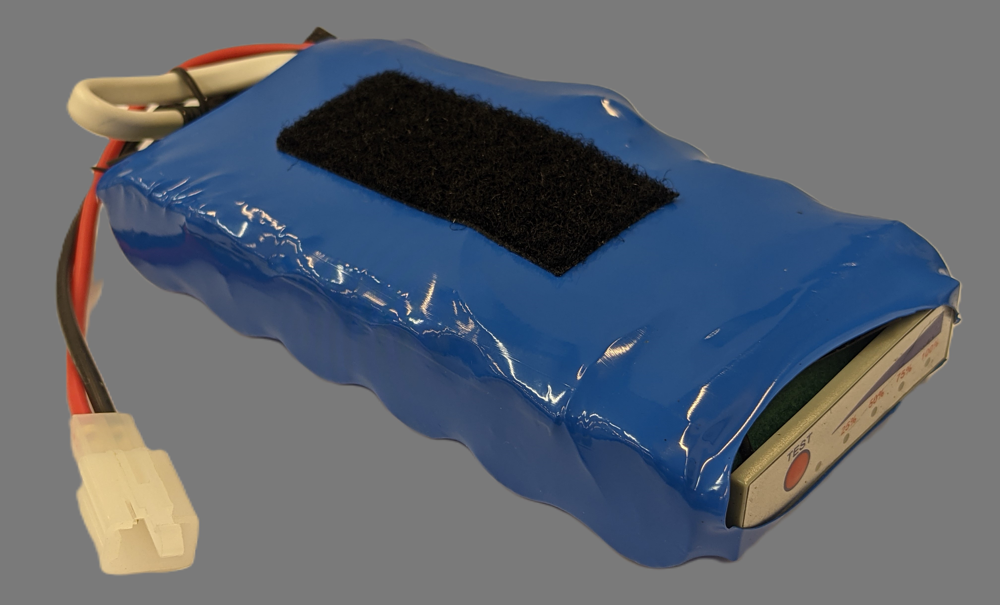
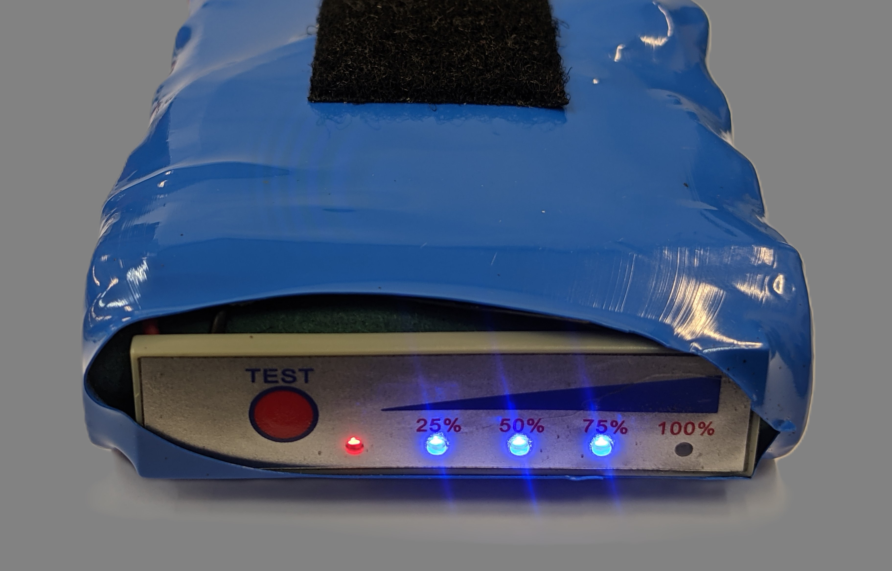

# Powering the AR Magic Lantern

The ARML can be powered by a [lithium ion battery pack](#battery-specifications) or [with an external 12V power supply](#using-a-12v-power-supply). For development, the ARML can be run without the projector using a [USB Type-C power supply](#using-usb-c-power).

## Using a 12V power supply

You can power the ARML system, including the projector, by substituting the battery for an appropriate 12V power supply (p10). The power supply should support at least 5A of current. You will need to use the adaptor cable included with the ARML that adapts the plug of the power supply (standard 5.5mm barrel jack) to the Tamiya-compatible connector in the battery compartment of the ARML (p9).

*Figure 1: photo showing an external power supply connected to the ARML using an adaptor from 5.5mm barrel jack to Tamiya connector.*

## Using USB-C power

When an appropirate USB-C power supply is connected to the back of the lantern, it will provide power to all components of the system except the projector. A common use case for powering it this way is when there is also a monitor, keyboard and mouse attached to the device, by way of a USB hub (see [Peripherals: USBHUB](peripherals.md)).

*Figure 2: photo showing ARML in "development mode", with a USB hub connected to the USB-C port on the back of the device.*

The USB-C power supply must be compatible with the USB PD (Power Delivery) standard, must support 12V, and should be rated to deliver at least 45W of power (recommended rating is 60W or higher). Adapters designed for laptops that support a USB-C PD power supply will probably work. See [Peripherals: USBPD](peripherals.md).

## Battery specifications

The battery used in the AR Magic lantern is a custom fabrication that includes a built in BMS (Battery Management System) to prevent over-charging and over-discharging, as well as simple fuel gauge mounted to the front of the pack.

*Photo of ARML battery pack, showing the Tamiya plug that connects it to the ARML.*

*Close-up photo of the front of the ARML battery pack, showing the fuel gauge after the "TEST" button has been pressed*

| Attribute                 | Value                 |
|---------------------------|-----------------------|
| Dimensions                | 135x75x25mm           |
| Weight                    | 300g                  |
| Nominal capacity          | 10Ah                  | 
| Nominal voltage           | 12.6V                 |
| Quantity of cells         | 6 cells               |
| Cell specification        | 3.7V 5Ah 21700        |
| Cell combination          | 1 series / 3 parallel | 
| Cell size                 | 140x74x25 mm          |
| Discharge speed           | 1C                    |
| BMS current rating        | 40A                   |
| Discharge cut-off voltage | 8.4V                  |
| Charging cut-off voltage  | 12.6V                 |
| Nominal current rating    | 20A                   |
| Peak current rating       | 20A                   |
| Continuous current rating | 30A                   |
| Max charge current        | 5A                    |
| Charging mode             | CC/CV                 |
| Power rating              | 120W                  |
| Charge time (2A)          | 12 hours              |
| Rapid charge time (5A)    | 3 hours               |
| Lifespan                  | Up to 800 cycles      |
| Temperature range         | -20 to 60 deg C       |

## Troubleshooting power issues

### ARML doesn't boot

When the RTC battery ([Components Figure 3, p1](components.md)) is exhausted, the mainboard no longer powers on with main switch ([Components Figure 2, p5](components.md)). This is due to a known issue in the current LattePanda release. When this happens, you can manually power on the mainboard after powering on the main switch by opening the battery compartment and pressing a small button ([Figure 1, p2](#using-a-12v-power-supply)). You should also replace the RTC battery with a 3V CR2477 long-life lithium battery. 

