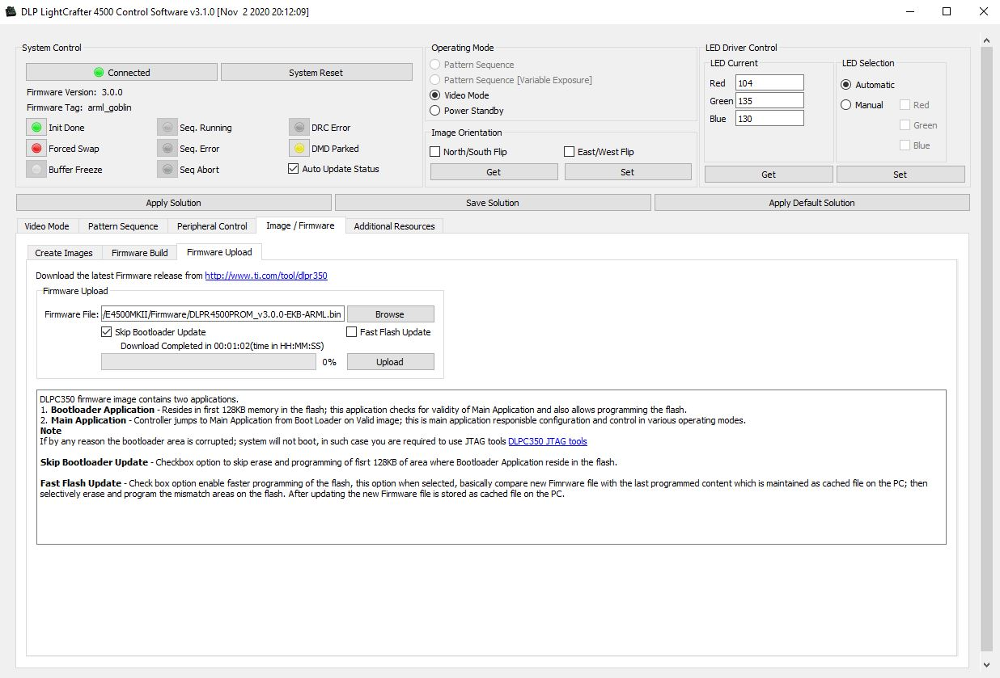
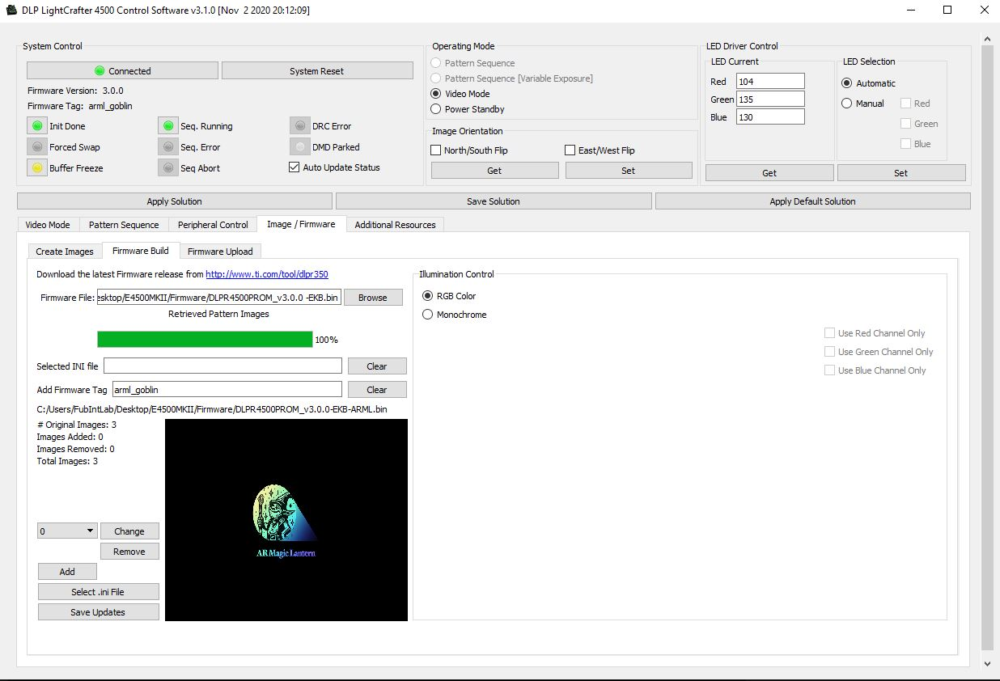

# ARML Projector Configuration Guide

The projector in the ARML is the [EKB Technologies E4500MKIIRGBHP-OXF DLP development module](https://www.ekbtechnologies.com/e-store/dpm-e4500mkii-focus-extended-depth-of-focus-800-lumens-on-axis). It works "out of the box" by connecting it to a video source via the mini-HDMI port. We have customized the firmware by adding the ARML logo to the splash screen.

## Loading the custom firmware

1. On a Windows machine, download and unzip the firmware management tool [archive](images/E4500MKII.zip), which includes the custom image.
2. Run the "LightCrafter4500.exe" file from the `E4500MKII\GUI` directory.
3. Connect the projector to the computer using a USB cable (the port on the projector is micro-USB).
4. Select the "Image/Firmware" tab, and then the "Firmware Upload" sub-tab.
5. In the "Firmware File" input, choose the "DLPR4500_v3.0.0-EKB-ARML.bin" firmware file from the `E4500MKII\Firmware` directory.
6. Click "Upload".

*Figure 1: Screenshot of the projector firmware management tool in the upload firmware mode.*

## Customizing the splash screen

1. Follow step 1 and 2 above to run the firmware management tool.
2. Select the "Image/Firmware" tab and then "Firmware Build" sub-tab.
3. In the “Firmware File” input, choose the "DLPR4500_v3.0.0-EKB-ARML.bin" firmware file from the `E4500MKII\Firmware` directory.
4. In the “Add Firmware Tag” input, give your firmware a name (e.g. "arml_custom").
5. Click the "Change" button and select the desired image. It must have a resolution of 912x1140 and saved in a 24Bit bitmap file format. For an example, download the [ARML logo bitmap file](../media/assets/bmp/arml_logo_ekb.bmp).
6. Click “Save Updates” and save the new firmware file. Make sure to end its name with a .bin suffix (the GUI does not add the file extension automatically).
7. Follow steps 3-6 above, but choose the file you just saved in step 5.

*Figure 2: Screenshot of the projector firmware management tool in the build firmware mode.*