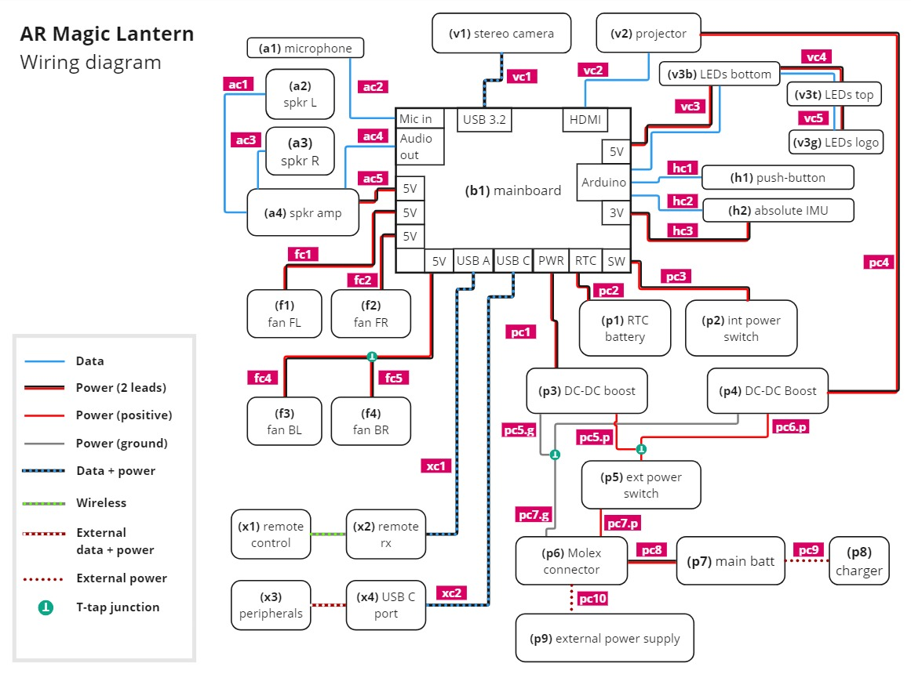
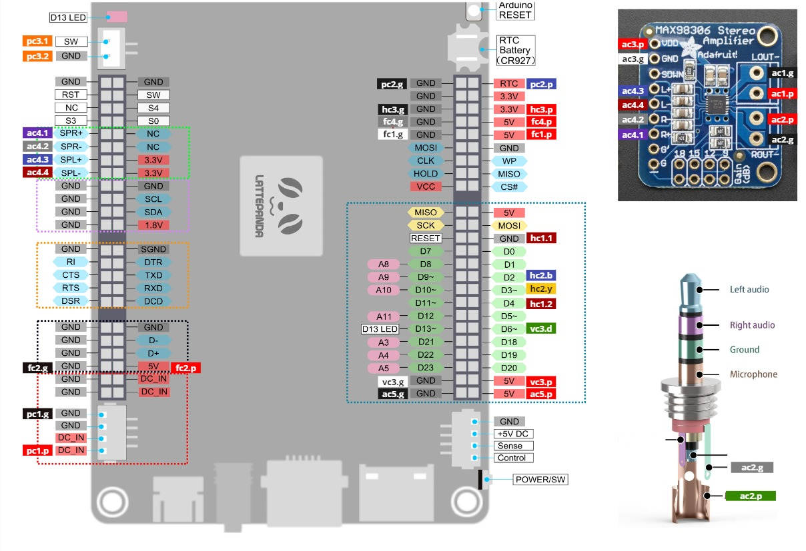

# ARML Wiring Reference

## Wiring diagrams

*Diagram showing components of the AR Magic Lantern and the wiring between them. The labels on each connection correspond to labels in the image of the component enpoints and in the component list. The labels on each component refer to the [Component Reference](components.md) page.*

*Figure showing the mainboard, audio amplifier circuit and audio jack, labelled to show the endpoints of the wires that correspond to labels on the above wiring diagram figure*

## Wiring components

L = length (mm),
C = color(s)

| | Type | L | C | Description |
| --- | --- | --- | --- | --- |
| ac1, ac3 | 30AWG | 120 |   | Positive and negative leads coming out of TangBand speakers (see Components a2,a3) |
| ac2 | Plug |     |     | TRRS Male Plug 4 Pole 3.5mm  [Amazon](https://www.amazon.es/gp/product/B078HQBNY1) |
|     | Shield | 340 |     | Copper leaf shielding tape, adhesive, 15mm wide  [Amazon](https://www.amazon.es/dp/B095WRKZ3V) |
| ac2.p | 28AWG | 340 |  | Microphone lead, positive |
| ac2.g | 28AWG | 340 |   | Microphone lead, ground. Connect to shield at mic and plug ends |
| ac4.1 | 28AWG | 150 |  | Audio line out, right channel, positive |
| ac4.2 | 28AWG | 150 |   | Audio line out, right channel, negative |
| ac4.3 | 28AWG | 150 |  | Audio line out, left channel, positive |
| ac4.4 | 28AWG | 150 |  | Audio line out, left channel, negative |
| ac5.p | 28AWG | 100  |  | Audio amp power, positive |
| ac5.g | 28AWG | 100  |  | Audio amp power, ground |
| vc1 | USB 3.1 SuperSpeed | 500 |     | Cable: USB C to USB A SuperSpeed 3.1 Connects camera to mainboard 90 degree male both ends, 50cm length  [Cablepelado](https://www.cablepelado.es/cable-usb-c-3-1-macho-a-usb-a-3-1-macho-acodado-0-50-m-negro) |
| vc2 | HDMI | 100 |     | CYFPV CN-018-LE HDMI Type A Male Connector 90 degree angle (up-left)  [Amazon](https://www.amazon.es/dp/B0894T9534) [Newegg](https://www.newegg.com/p/0ZF-010R-000K5) |
|     |     |     |     | CYFPV CN-017-UP Mini HDMI Type C Male 90 Degree angle (up)  [Amazon](https://www.amazon.es/dp/B01M8HDX8Z) [Newegg](https://www.newegg.com/p/183-0071-000B8) |
|     |     |     |     | CYFPV CN-019-0.2M Flat Cable 0.5mm Pitch 20Pin 10cm  [Amazon](https://www.amazon.es/dp/B01M0ANUUF) |
| vc3.p/g/d | 24AWG | 380 |  | LED strip to Arduino, positive/negative/data |
| vc4.p/g/d | 24AWG | 160 |  | LED strip chaining, positive/negative/data Wires split in the middle, joined with Dupont connectors |
| vc5.p/g/d | 24AWG | 200 |  | LED strip chaining, positive/negative/data |
| fc1.p/g | 30AWG | 190 |  | Front-left fan power, positive/ground |
| fc2.p/g | 30AWG | 190 |  | Front-right fan power, positive/ground |
| fc4.p/g | 30AWG | 150 |  | Back-left fan power, positive/ground |
| fc5.p | 30AWG | 60  |  | Back-right fan power, positive Connect to T-taps (cx2) on fc4.p|
| fc5.g | 30AWG | 70  |  | Back-right fan power, ground Connect to T-taps (cx2) on fc4.g |
| hc1.1 | 28AWG | 380 |  | Connects push-button to Arduino (1) |
| hc1.2 | 28AWG | 380 |  | Connects push-button to Arduino (2) |
| hc2, hc3 | QWIIC (30AWG) | 140 |  | Connects IMU to mainboard 4-pin QWIIC connector on one end  [Amazon](https://www.amazon.es/gp/product/B08HQ1VSVL) |
| pc1.p | 20AWG | 75  |  | Mainboard power, positive |
| pc1.g | 20AWG | 80  |  | Mainboard power, ground |
| pc2.p | 28AWG | 160 |  | RTC battery positive |
| pc2.g | 28AWG | 140 |  | RTC battery ground |
| pc3.1 | 28AWG | 100 |  | Internal power switch lead 1 |
| pc3.2 | 28AWG | 100 |  | Internal power switch lead 2 |
| pc4 | 18AWG | 200 |     | Cable with 5.5mm barrel jack Connects boost converter to projector Barrel jack end has 90 degree angle  [Amazon](https://www.amazon.es/dp/B0B1QDBSLC) |
| pc5.g | 18AWG | 50  |  | Connects boost 1 (mainboard) to T-tap (cx1) on pc7.g |
| pc5.p | 18AWG | 45  |  | Connects boost 1 (mainboard) to T-tap (cx1) on pc6.p |
| pc6.p | 18AWG | 480 |  | Connects ext power switch to boost 2 (projector) Female spade connector (cx5) on power switch end |
| pc7.g | 18AWG | 240 |  | Connects Tamiya connector (cx4) to boost 2 (projector) |
| pc7.p | 18AWG | 420 |  | Connects ext power switch to Tamiya connector (cx4) Female spade connector (cx5) on power switch end |
| pc8.p/g | 16AWG | 120 |  | Connects Tamiya connector (cx4, male) to battery |
| pc9.p/g | | 60  |  | Provides plug (5.5mm barrel, female) for charging battery |
| cx1 | T-Tap Connector |     |     | Scotch Lock connector 18-22 AWG  [Amazon](https://www.amazon.es/dp/B07G9HBYGH) |
| cx2 | T-Tap Connector |     |     | UG Wire Connector 19-26 AWG  [Amazon](https://www.amazon.es/dp/B0CPPKFJVG) |
| cx3 | JST Connector |     |     | JST PH 2.0 4-pin female IC plugs  [Amazon](https://www.amazon.es/gp/product/B0C61SJFCC) |
| cx4 | Tamiya connector |     |     | Tamiya compatible 2-pin 13.5mm 10A connector  [Amazon](https://www.amazon.es/dp/B07ND8SPBH) |
| cx5 | Spade connector |     |     | Spade wire connectors, 10A 16-22 AWG (red)  [Amazon](https://www.amazon.es/gp/product/B07DXFC9TJ) |