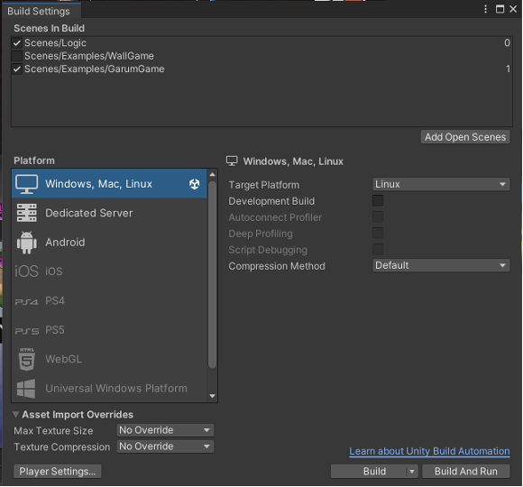
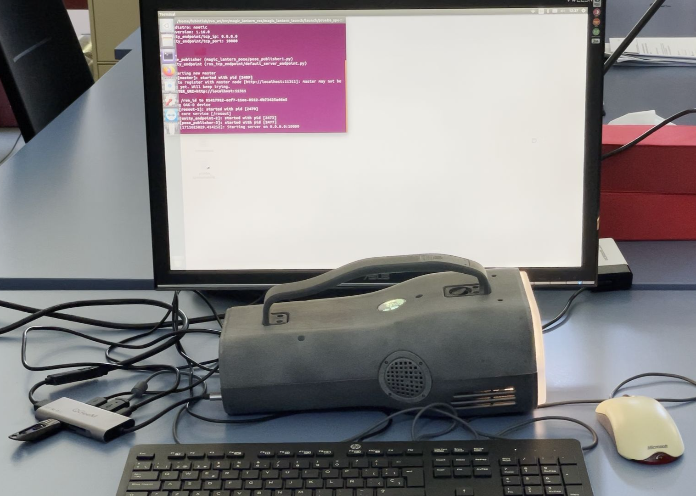

# Building and running applications
The following steps describe in broad terms the workflow of developing an application and deploying it on the ARML device.

## 1. Initialize Unity project:
The SDK includes a Unity project that contains all the components and libraries needed to build and run applications for the ARML.  
- Use this project as a template by duplicating it and using the copy as the starting point for your application.

## 2. Edit Unity project: 
1. Open the project and navigate to the Scenes -> Examples folder (in project Assets) and open one of the example scenes (Wall Game or Garum Game).
2.  Press the play button to start the game in the editor. You will notice that the Logic Scene is loaded in the hierarchy automatically. 
3. If you want to edit the scene, we suggest duplicating it and editing the duplicate.

## 3. Build the application
  
*Screenshot of the Build Settings window configured for building the Garum Game example scene to the ARML.*

When ready to build the application for the ARML, follow these configuration steps in the Build Settings window:
1. In the “Scenes in Build” list, make sure Logic Scene is checked, as well as the game scene you want to run. Make sure the game scene checked here is also set as the “Load on start” property in the GameController component in the Logic Scene. See SDK Configuration section for details.
2. Choose platform “Windows, Mac, Linux” and choose Linux as the “Target Platform.” Use the “Build” button to build the application to a local directory. Choose a name for the “Save as” value that clearly identifies your application, because this is the name that will show in the ARML launcher.

## 4. Copy application files to ARML device
  
*Photo of ARML in developer mode, with mouse, keyboard, monitor, power and USB drive attached through a USB-C hub.*

1. Copy the build directory to a USB drive. 
2. Using a hub, plug a mouse, keyboard, monitor and USB-C power supply (PD) into the USB-C port on the back of the ARML. The ARML will boot and show the launcher app on the monitor.
3. Press “ESC” key on keyboard to return to the Ubuntu desktop.
4. Insert the USB drive into the hub and copy the build directory to the “unitybuilds” directory on the Ubuntu desktop.
5. In the build directory that you just copied, find the executable file which ends in “.x86_64”, right click and choose “Properties” from the context menu. Navigate to the “Permissions” tab and check the box for “Allow executing file as program.”
6. Close the Properties window.
7. Double click the executable file to run the application.

## 4. Debug the application
While the application is running on the ARML, press the “Q” on the keyboard or the menu button (3 horizontal lines) on the ARML remote control to show debug information in the projection. Debug information includes:  

- In the lower-left corner, the Unity debug log, which contains the same as the log in the Unity editor.
- In the upper-left corner, information about the connection to ROS, which manages the VIO tracking subsystem.
- In the upper-right corner, the display of the debug components (see component guide).
